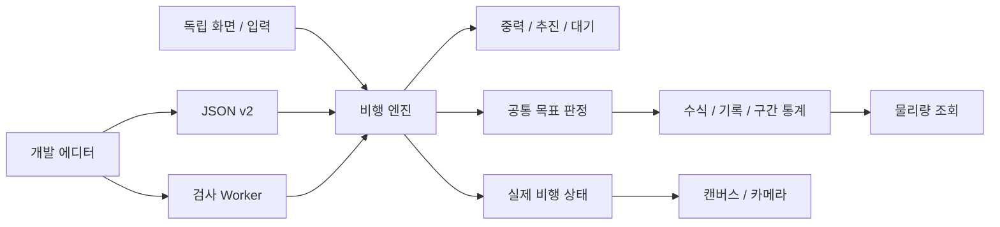

# 모듈과 물리 계약

`main.ts`가 단일 프레임 루프와 화면 전환을 소유합니다. 이전 화면은 이벤트·작업자·타이머를 정리합니다. 에디터는 DEV 조건에서만 동적으로 가져옵니다.

## 공용 상태

`Stage`는 천체·오브젝트·목표·출발 천체·규칙·성공 경로를 담습니다. 목표는 `{id,title,condition,position,startTime,endTime,dependsOn,display?}`입니다. 임무 유형 필드는 없습니다. `display`는 안내 영역이며 판정이 아닙니다.

`Run`은 위치·속도·명령 적용·연료·분리체·천체 상태·목표 기억을 소유합니다. 기록과 통계는 목표별로 분리되고 새 비행마다 초기화됩니다. 실행 중 소스를 변경하지 않습니다. 관측 기록을 끈 설계 검사도 같은 판정을 사용합니다.

일반 종료 화면은 현재 스테이지의 재도전으로 이어집니다. 제작 시험에만 제작 화면 복귀 버튼을 제공합니다. `playScreen`은 입장 때 스테이지를 복제하고 계획·비행·관측·남은 시도를 화면 안에 소유합니다. `App`에는 설정과 완료 ID만 공유하며, 임무 간 물리 상태나 자원은 전달하지 않습니다.

`RoutePlan`에 첫 추진·예약 수정 추진·부표·엔진 명령을 저장합니다. 발사 순간 복사본으로 확정합니다. 비행 중 편집하지 않습니다. Trial은 당시 전체 예약, 실행 ID, 복사할 실행 계획, 실제 프레임을 별도로 보관합니다. 재생은 녹화 상태를 읽으며 엔진을 다시 실행하지 않습니다.

## 물리

오른쪽 +X, 위 +Y, 거리 u, 시간 t입니다. 최대 물리 간격은 0.01t이고 명령 시각에서 분할합니다. RK4로 적분합니다. 화면 크기·카메라는 판정에 사용하지 않습니다.

- 고정·지정 원형 공전 천체는 외부 중력장을 제공합니다. 상호 중력을 켠 천체는 서로의 중력을 동시에 적분합니다.
- 로켓의 중력 적분은 시험 질점 모델이며 거대 천체에 대한 반작용을 무시합니다. 접촉은 전체 동체 캡슐로 판정합니다. 물리 위치는 로켓 바닥이고 그림은 그 앞에 그립니다. 출발 위치·속도는 출발 천체·각도·반지름에서 계산하며 에디터 변경·비행 생성에도 동일하게 적용합니다. 다단 로켓은 이륙 전 발사대가 지지하지만 연료는 소모하며, 이륙 후 지면 충돌을 정상 판정합니다.
- 기본 모델은 예산이 유한한 즉시 Δv입니다. 연료 모델은 질량 감소·로켓 방정식·추력·배기 속력·재점화 한도를 적용합니다.
- 분리체는 원래 바닥에 남고 위 로켓은 한 단 길이만큼 앞에 배치해 끝 위치를 이어갑니다. 분리 스프링의 작은 상대 속도는 질량비로 나누어 총 운동량을 보존합니다. 다음 엔진은 자동 점화하지 않습니다. 분리체를 대상으로도 사전 엔진 명령을 예약합니다.
- 지수형 대기·상대 공기 속도·항력·동압·가열은 게임용 근사입니다.
- 충돌은 이동 캡슐과 움직이는 원의 연속 교차입니다. 코끝·옆면·고속 통과를 검사하며 몸체 전체를 표면 밖으로 정렬합니다. 그림과 판정은 world/hull.ts의 세계 좌표 치수를 공유합니다. 단 수가 줄면 두 크기가 함께 줄어듭니다. 주 로켓은 반동을 보여 준 뒤 실패합니다. 안전한 접촉은 정착 상태로 유지할 수 있습니다.
- 블랙홀 경계 안의 탐사체는 복귀할 수 없습니다. 일반상대론을 사용하지 않습니다.

## 화면과 제작

조준과 화살표는 같은 세계 좌표 배율을 사용합니다. 로켓 드래그는 잡은 지점의 이동량, 손잡이 드래그는 기존 추진값에 이동량을 더합니다. 확대·이동·크기 변경 때 현재 제스처를 끝내어 화면 변화가 추진값으로 섞이지 않게 합니다. 좌표 변환에는 CSS 크기를 사용하고 화면 픽셀 밀도는 렌더링에만 적용합니다.

각 화면은 `Screen`의 `frame`/`dispose`만 제공합니다. 도움말·설정은 비행 엔진 없이 독립 수정할 수 있습니다. 공통 상태만 `App`으로 전달합니다.

에디터는 시험 화면에 성공 경로 저장 및 개발 관찰 콜백을 넘깁니다. 관찰창은 판정 기억의 복사본을 읽어 실제 통계에 영향을 주지 않습니다. 일반 캠페인에는 이 콜백이 없습니다.

undo/redo는 선택 상태도 저장합니다. UUID 복제는 대상·비행체·선행 참조를 바꿉니다. 변경 후 이전 검사 Worker를 종료하고 새 스냅샷을 검사합니다. 저장 API는 로컬·동일 출처 요청의 검증된 UUID 파일을 원자적으로 교체합니다.

## 재시도와 충돌 연출

`world/evidence.ts`는 제작자가 정의한 관측 수식·측정 조건·상황 단서를 실제 물리 스텝에서 수집합니다. 목표의 메모리와 독립적입니다. `Run`에는 현재 비행 관측을, 플레이 화면에는 이 스테이지의 완료 실험 목록을 보관합니다. 실제로 적용한 명령만 실험 카드에 복사하며 반복 실험은 동일한 초기 조건을 사용합니다. 부표·연료·분리체 상태는 매번 새로 생성하므로 이전 비행이 물리적으로 다음 로켓에 기여하지 않습니다. 새 도전에서 횟수를 회복해도 누적 기록은 유지합니다.

`editor/learning-inspector.ts`가 단서 제작 UI를 제공합니다. 기존 목표의 공통 블록과 같은 언어를 사용하며 판정값을 플레이어에게 노출하지 않습니다. 기존 variation/dimensions/randomization 모듈은 선택적인 제작 연구로 남고 런타임 재시도에 사용하지 않습니다. [진행·제작 계약](puzzle-loop.md)을 참고합니다.

`impact.ts`는 충돌 순간 자세를 보관하고 한 번의 감쇠 반동 후 실패로 전이합니다. 반동 중 속도 부호를 자세로 다시 변환하거나 지면 충돌을 반복 계산하지 않습니다. 화면 프레임에서 정상 비행과 충돌 연출은 한 번만 갱신합니다.

비행 계획 UI는 screens/flight-timeline.ts, 장치 출력·연료 안내는 world/program.ts, 기록 재생은 world/replay.ts, 로켓 아트는 render/rocket-sprite.ts에 있습니다. 담당을 나누어 수정할 수 있으며 크기 변경은 hull 계약을 함께 리뷰합니다. [상세 계약](flight-program.md)을 참고합니다.
